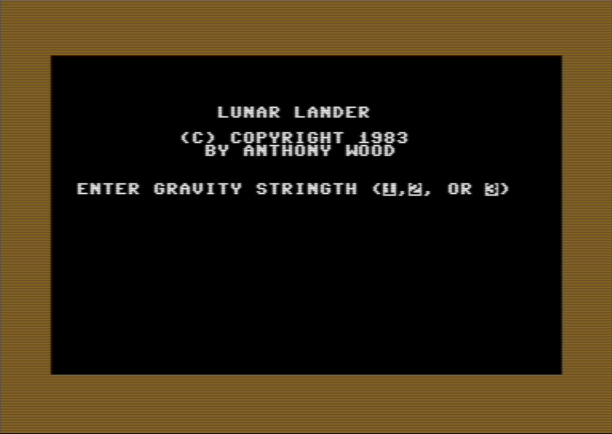

# Lunar Lander
Lunar Lander was an implementation of the popular arcade game that I wrote in BASIC with a small 6502 machine language subroutine to help with the animations.  This was the first 6502 code I wrote, and I hand assembler since i did not own an assembler (yet) for the 6502.  Ahoy! [purchased Lunar Lander for $400 in 1984](../../scans/1984-10-3-ahoy.pdf), and it made the cover of the April 1984 edition.

   - [Ahoy! Magazine Article](Ahoy-issue-04.pdf)
   - [BASIC source code](lunar-lander.c64basic)
   - [C64 .d64 file playable in a C64 Emulator](lunar-lander.d64)

