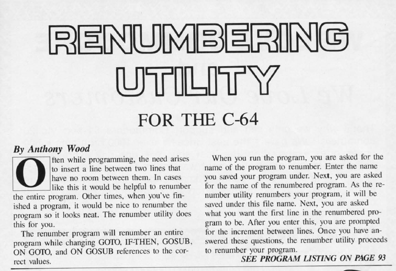

# Renumber

Renumber was a BASIC program that would renumber BASIC programs.   BASIC code was entered in the day using line numbers for each line of code.  The practice was to use incremetns of 10.  For example, line 10, 20, 30, etc.   As you wrote your code, your line numbers would be come disordered and sometimes full (you might need to insert more than 9 lines between 100 and 110).  Renumber would renumber your code with nice increments of 10, and updated all the GOTOs, GOSUBS and THENs to the correct new line number.  I received $200 for "Renumber" when it [was published in Ahoy!](./../../scans/1984-6-15-ahoy-composite.jpg) magazine in April 1985, 

