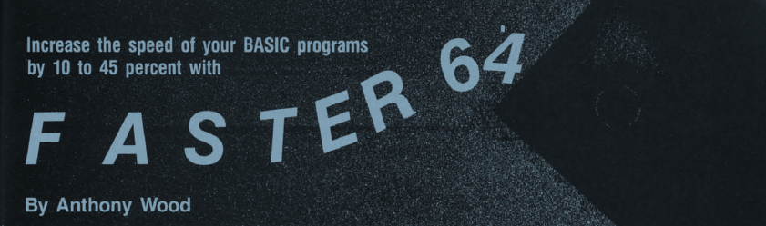

# Faster 64

Faster 64 is a 6502 machine language program that analyzed your BASIC variable usage.  A programmer could speed up their program by defining their BASIC variables in the order they were most often used.  It [was published in Ahoy!](./../../scans/1984-6-15-ahoy-composite.jpg) magazine in April 1985, alongside [Space Hunt](./../space-hunt/readme.md).

[Ahoy! April 1985 Article](./faster64-ahoy-april-1985.pdf)

