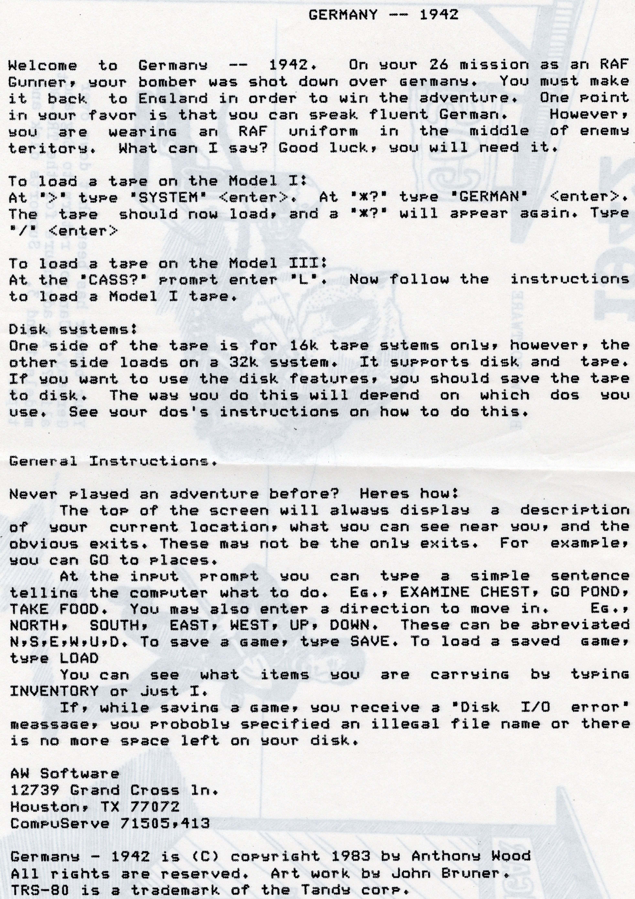

# Germany 1942
I wrote this text adventure using an adventure creation language I wrote at about the same time.  Three files would be tokenized using a BASIC program I wrote and then appended to a machine language runtime interpreter that I also wrote to produce a machine language game.  

   - [Play Germany 1942](https://1drv.ms/u/s!AmFZ0QYkZ-tXg7k302hEFUNUvaK5xg?e=MBv5EW) using my Windows TRS-80 Emulator.
   - [GERMANY.ADV](GERMANY.ADV) is the main program text file (written in my adventure language)
   - [GERMANY.LOC](GERMANY.LOC) is a text file that describes each room of the adventure, and which rooms it is connected to
   - [GERMANY.TIT](GERMANY.TIT) is the text file output of a BASIC graphics editor I wrote to create a graphic title screen.  It produces a sequence of video memory location and bytes
   - [My Notes and Map](./../../scans/germany-1940-notes.jpg)
   - Germany 1942 was "published" by [AW Software](./../../awsoftware/readme.md)

