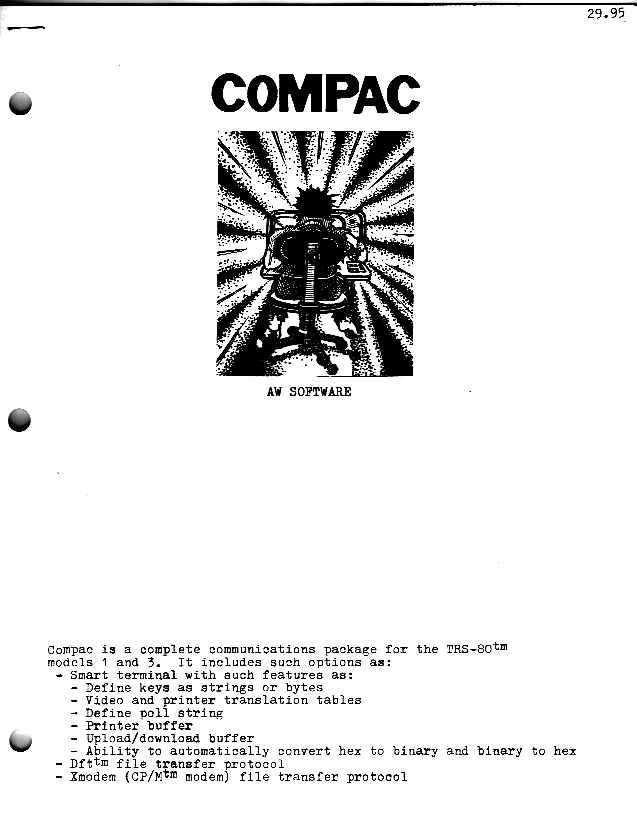
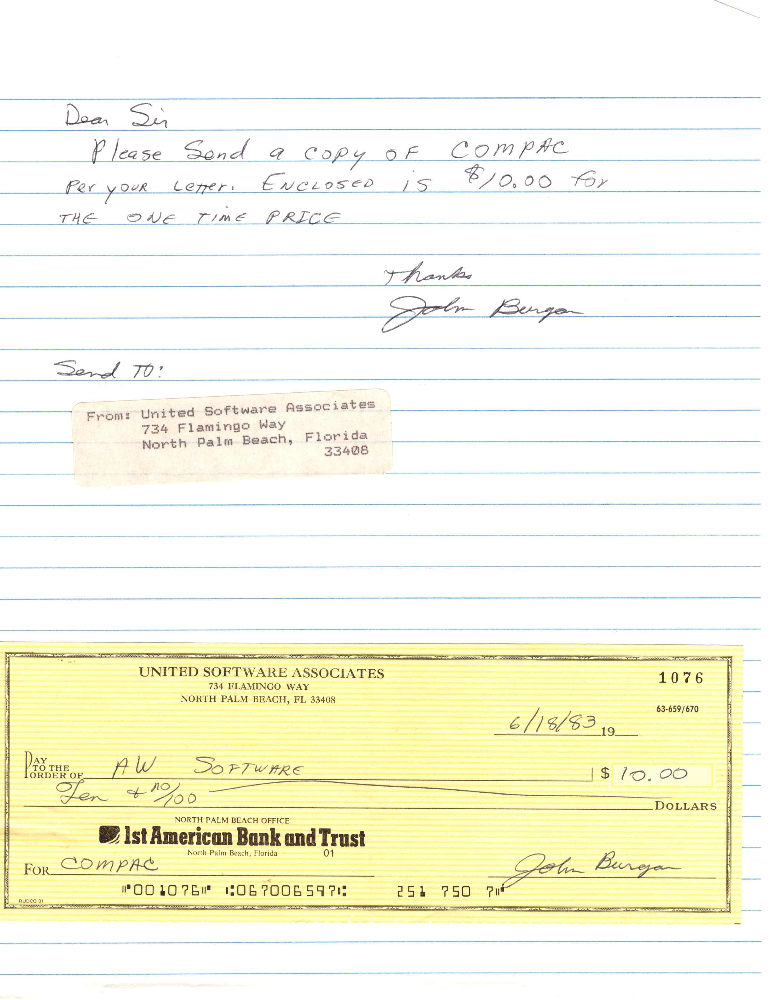
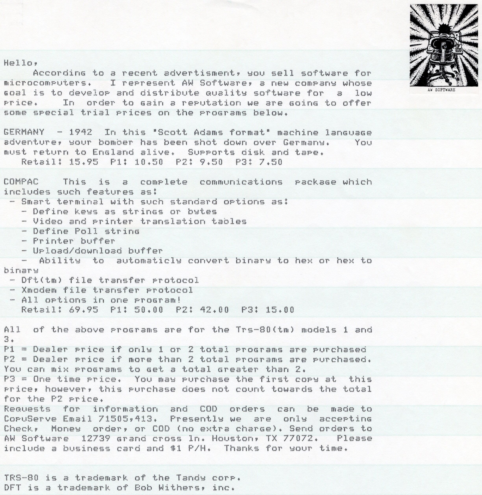
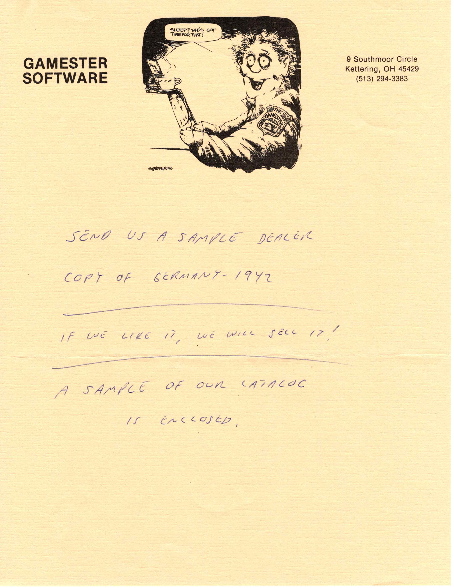
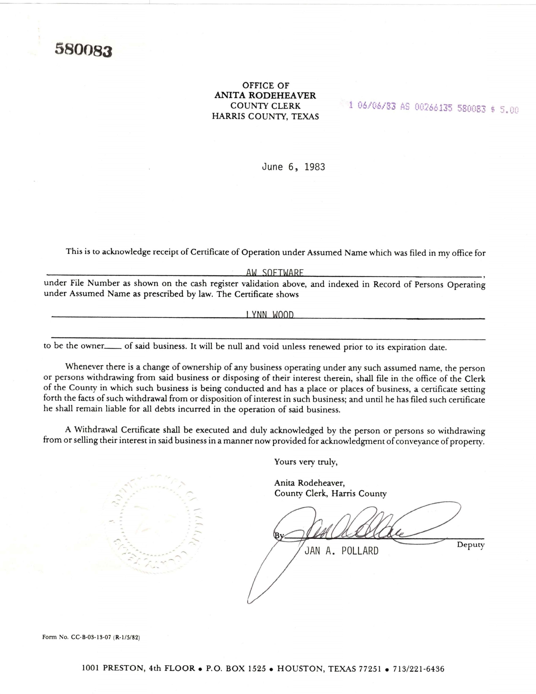
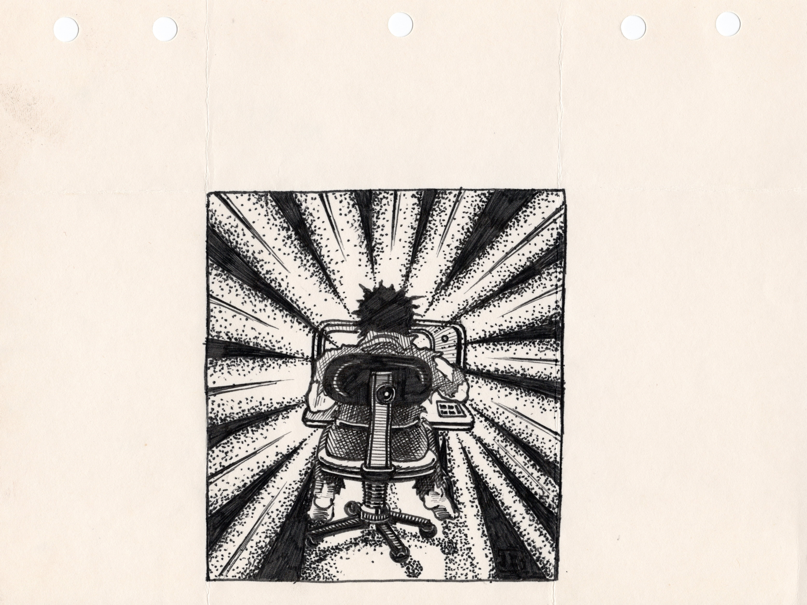

# AW Software
While in high school (1979 to 1983) I started my first company AW Software.  I created two products for the TRS-80 microcomputer I tried to sell: [Compac](./../TRS-80/compac/README.txt) and [Germany 1942](./../TRS-80/germany-1942/readme.md).    

Compac was  a "smart terminal" program that let users use their modem to log into online BBS (the predecessor to the internet).  Compac also implemented multiple file transfer protocols, such as xmodem,  to allow users to transfer files to each other.  I had the Radio Shack 300 BAUD modem at the time, and remember coveting a [Hayes smart modem](https://en.wikipedia.org/wiki/Hayes_Microcomputer_Products) (which i could not afford).

The coolest file transfer protocol I added to Compac was one I invented that allowed full-duplex file exchange. That is, one person could send a file to another person, while also simultaneously receiving a file..  So you could, you know, pirate software with a modem at twice the normal rate.  The second was Germany 1942, a text adventure.   Both were available on cassette tape or 5.25� Floppy Diskette.   

AW Software was not particularly successful, I sold one copy of Compac.  The software was pretty good, but I was in high school and didn't know much about marketing or selling software.

Anthony Wood

November 2023