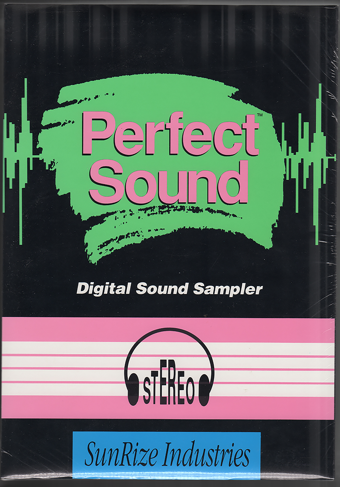
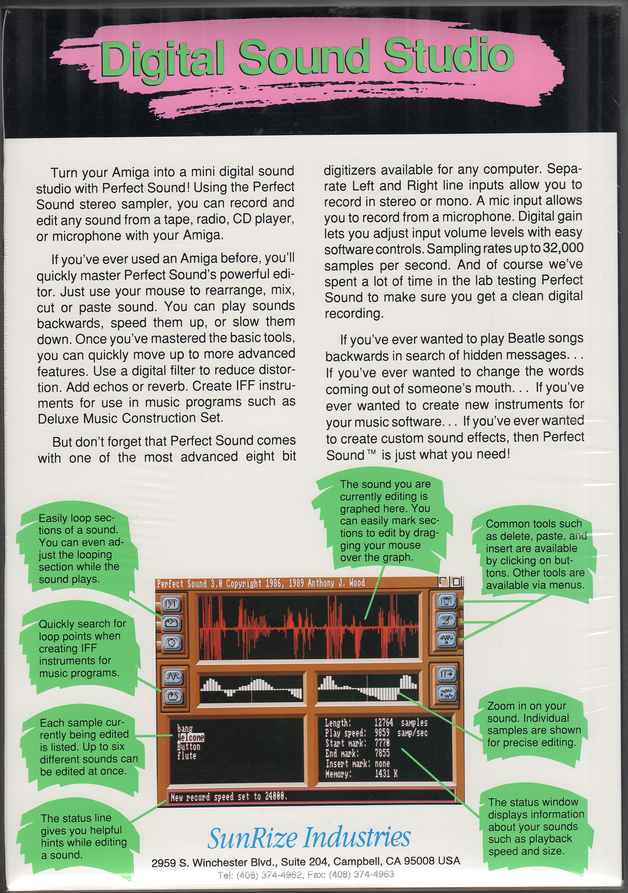
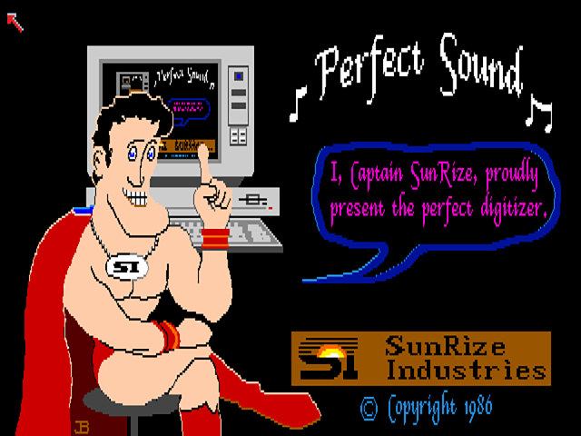
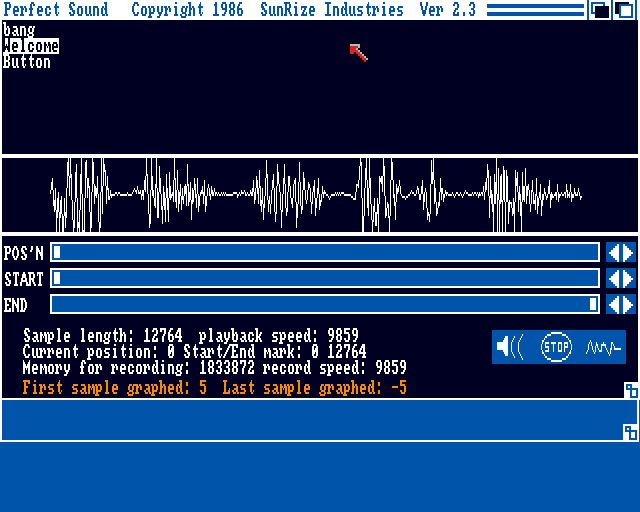
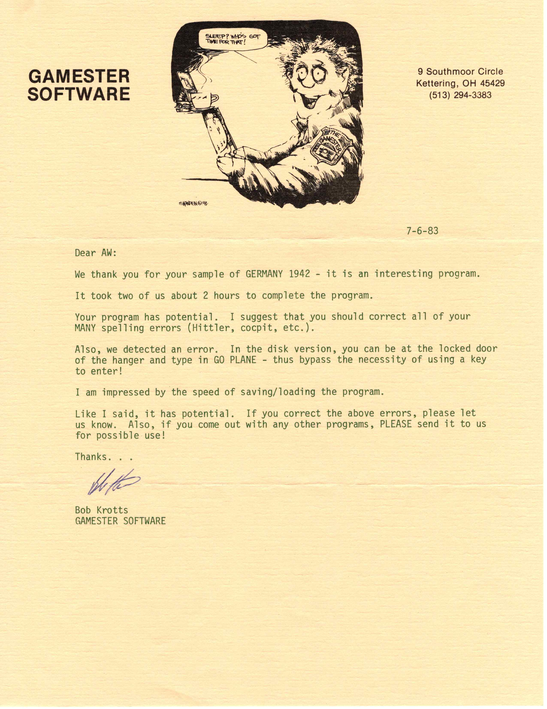

# Anthony's Early Software Code

[All of my early software and a more complete history](https://github.com/ajwood1965/anthony-code-history/#readme) is available on Git Hub.

Here I have highlighted four of my favorite programs from this time. 
   - Perfect Sound - Sound Sampler for Amiga - junior in college.
   - Lunar Lander - A Commodore 64 game I sold while a senior in high school.
   - Germany 1942 - Text Adventure for TRS-80 - 12th grade
   - Battle Star Galactica - game for PDP-11 -  8th grade

# Perfect Sound
[Click here for more in-depth pictures and code](amiga/perfect-sound/readme.md)

Perfect Sound was top selling 8-bit sound sampler for the Amiga computer that I developed while a Junior in college in 1986.  I designed the hardware, wrote the software, wrote the manual, and got people to sell it.

## Version 3.0 Package
  

## Version 2.3 Title Screen
Here is the title screen and the UI from version 2.3.   Version 3.0 was more polished, but this was more fun.

## Version 2.3 User Interface

Perfect Sound can be run in an Amiga Emulator.

[Click here for more in-depth pictures](amiga/perfect-sound/readme.md)

# Lunar Lander
[Click here for more in-depth pictures and code](C64/lunar-lander/readme.md)

In late high school I wrote software for the Commodore 64 and sold some to Ahoy! Magazine.  The game I sold for the most money ($400!) is Lunar Lander inspired by the arcade game.   You can also see a much [more primitive version](./../TRS-80/spacetaxi/spacetaxi-screenshot.png) I wrote for the TRS-80 a couple years earlier here.

[Ahoy! Magazine Article](C64/lunar-lander//lunar-lander-ahoy-april-1984.pdf)

Also playable in a C-64 emulator.

# Germany 1942
[Click here for more in-depth pictures and history](TRS-80/)

While in high school I was interested in text adventure games, a type of puzzle game popular then.   I wrote a computer lanagage and set of tools for writing text adventures, and atempted to sell on of the games I wrote -- Germany 1942.

## Game Art

## Dealer Letter

Germany 1942 can be played using my TRS-80 windows emulator.

# Battle Star Galactica

[Click here for more on my 9th grade software](pdp-11/readme.md)

While in 8th grade in Holland I taught myself to program computers.  Mostly by using my middle school's PDP-11 after school.  The first game I wrote was Battle Star Galactica.  Modeled after a popular type of game of the day.  Much different than today's games, it was played on a teletype console.

[Battle Star Galactica BASIC Code](pdp-11/battlestar-galactica.jpg)

You can play Battle Star Galactica using my BASIC emulator.  Also with this emulator you can play many popular games from this time period.

# More
Those are some highlights!  For much more visit [my git hub code](https://github.com/ajwood1965/anthony-code-history/#readme)

