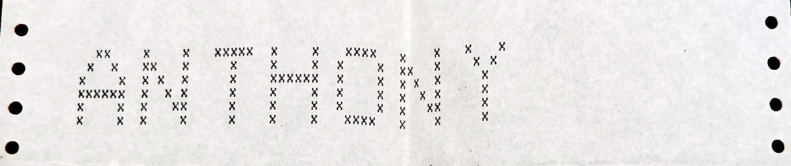

# Anthony J. Wood's Code Archive
Welcome to my early-years software collection.  Here you will find executable code, source code, magazine articles, notes, and rejection/acceptance letters.

# American School of the Hague and the Computer Museum

While attending 8th grade at the American School of the Hague I taught myself to program after school using the schools PDP-11,along with trips to the Hague's "computer museum" to use the time-sharing terminal and [Commodore Pet](https://en.wikipedia.org/wiki/Commodore_PET#/media/File:Commodore_2001_Series-IMG_0448b.jpg).

## PDP-11
My first code, including: ["Battle Star Galactica"](/pdp-11/readme.md)

# TRS-80
Back in Houston at the start of 9th grade [I got my TRS-80](aw-microcomputer-history.md), and while in high school I wrote the following programs.  

   - The Endless Tomb [ReadMe](./TRS-80/tomb/readme.md) | [TOMB.BAS](./TRS-80/tomb/tomb.bas.txt) | [Rejection](./scans/1981-7-20-creative-computing-tomb.jpg) |  [Play on Windows](./Win/basic-classics/ReadMe.txt)
   - Space Taxi
   - Micro Adventure System ReadMe
   - Ruins at Time's Edge [Rejection](./scans/1983-estimate-cload-ruins-at-times-edge.jpg)
   - Boot -n- Copy [ReadMe](./TRS-80/boot-n-copy/readme.md)
   - Quest for Fire [ReadMe](./TRS-80/quest-for-fire/readme.md)
   - Compac ReadMe | [AWSoftware](./awsoftware/readme.md)
   - Germany 1942 ReadMe | [AWSoftware](./awsoftware/readme.md)

# Commodore 64
Towards the end of high school I [purchased the super-cool Commodore 64](./aw-microcomputer-history.md) and wrote the following.

   - Lunar Lander [ReadMe](./C64/lunar-lander/readme.md) | [Article PDF with Source](./C64/lunar-lander/ahoy-april-1984-lunar-lander.pdf)
   - Space Hunt [Readme](//C64/space-hunt/readme.md) | [Article PDF with Source](./C64/space-hunt/space-hunt-ahoy-april-1985.pdf)
   - Renumber [Readme](./C64/renumber/readme.md) |  [Article PDF with Source](./C64/renumber/renumber-ahoy-july-1984.pdf)
   - Faster 64 [Readme](./C64/faster64/) | [Article PDF](./C64/faster64/faster64-ahoy-april-1985.pdf)
   - Banner [Readme](./C64/banner/readme.md)
   - 1541 Zip [Readme](./C64/1541zip/readme.md)
   - STerm 64 [Manual](./scans/1984-sterm64-instructions.pdf) | [Rejection](./scans/1984-9-7-broderbund-sterm64.jpg)

# Amiga
   - Perfect Sound
   - City Desk
   - Studio 16

# Windows
   - Windows Maze
   - AW Basic
   - Classic Basic Games
   - TRS-80 Emulator

# macromedia flash
   - Space Invaders

# Also...
   - [AW Microcomputer History](aw-microcomputer-history.md)
   - [AW Software](./awsoftware/readme.md)
   - [Rejection/Acceptance Letters](./scans/)

